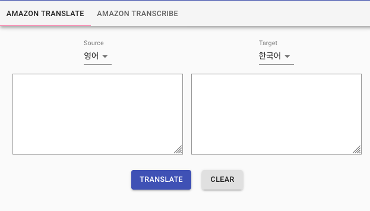

우리가 사용할 몇 가지 소프트웨어를 설치하고 업데이트 합니다.
```shell=
# Update the AWS CLI
pip install --user --upgrade awscli

# Install and use Node.js v12.x  (to match AWS Lambda)
nvm ls-remote | grep v12
nvm install v12.11.0
nvm alias default v12.11.0

# Install the AWS Amplify CLI
npm install -g @aws-amplify/cli
```

이 명령어들은 완료 되는데 시간이 수 분이 소요됩니다.

## 기본 region 설정하기

가장 좋은 방법은 인프라를 고객과 가까운 지역에 구성하는 것입니다. (Amplify는 서울 리전도 지원합니다.)

AWS config file이 없다면 Workshop 진행의 편의를 위해서 생성합니다.
```shell=
cat <<END > ~/.aws/config
[default]
region=ap-northeast-2
END
```
AWS Amplify CLI는 모바일과 웹 어플리케이션을 개발을 심플하게 해주는 강력한 기능들을 제공하는 툴체인 입니다.
위의 단계에서는 설치만 진행했기 때문에 설정 단계가 추가적으로 필요합니다. AWS Amplify CLI는 ~/.aws/config을 찾아 작업할 Region 정보를 판별합니다.

---

## React 어플리케이션 만들기
**create-react-app** CLI로 새로운 리액트 웹 어플리케이션을 만듭니다.

터미널에서 `npx create-react-app amazon-transcribe-translate-text`를 실행하고 새로 생성된 디렉토리로 이동합니다 `cd amazon-transcribe-translate-text`

> 이 명령어를 통해 amazon-transcribe-translate-text라는 이름을 가진 amplify 어플리케이션의 기본 구조를 생성합니다.


### 어플리케이션
* **amazon-transcribe-translate-text 디렉토리에서** `npm start` 명령으로 어플리케이션을 시작합니다.

* 정상적으로 어플리케이션이 동작하는지 확인합니다.


---

이제 간단한 React 앱을 만들었으므로 사용자가 번역기능을 사용할 수 있도록 만들겠습니다. 

> AWS Amplify CLI를 사용하면 React 및 React Native, iOS 및 Android 용 SDK를 사용하여 웹 및 모바일 앱에 클라우드 기능을 쉽게 추가 할 수 있습니다. 시작하기 위해 새 응용 프로그램을 만들고 사용자 인증을 활성화합니다. 그런 다음 AWS Amplify CLI가 구성을 담당하는 오픈 소스 [AWS Amplify JavaScript 라이브러리](https://aws-amplify.github.io/)를 사용하여 앱에 연결합니다. 우리가 해야 할 일은 React 앱에서 사용하는 것입니다. AWS Amplify에는 클라우드 서비스 작업에 대한 몇 가지 훌륭한 추상화가 포함되어 있으며 앱에서 사용할 유용한 React 구성 요소가 있습니다.

## Amplify 초기화

* **프로젝트 디렉토리에서** `amplify init`을 실행합니다.
* `AmplifyWorkshop` 또는 원하는 이름으로 프로젝트명으로 설정합니다.
3. 다른 값은 **기본값**을 선택합니다.
4. 프롬프트가 나오면 **default** 프로파일 또는 **사용하려는 리전**의 프로파일을 선택합니다.

```shell=
Note: It is recommended to run this command from the root of your app directory
? Enter a name for the project AmplifyWorkshop
The following configuration will be applied:

Project information
| Name: AmplifyWorkshop
| Environment: dev
| Default editor: Visual Studio Code
| App type: javascript
| Javascript framework: react
| Source Directory Path: src
| Distribution Directory Path: build
| Build Command: npm run-script build
| Start Command: npm run-script start

? Initialize the project with the above configuration? Yes
Using default provider  awscloudformation
? Select the authentication method you want to use: AWS profile

For more information on AWS Profiles, see:
https://docs.aws.amazon.com/cli/latest/userguide/cli-configure-profiles.html

? Please choose the profile you want to use default
Adding backend environment master to AWS Amplify Console app: d2cd6kfisdth3j
⠴ Initializing project in the cloud...
```

---
## 준비 작업

### React UI Framework
Material-UI은 리액트 개발에서 쉽게 사용할 수 있는 UI Framework 입니다.

[Material-UI 홈페이지](https://material-ui.com/)

프로젝트에 사용하기 위해서 프로젝트 폴더로 이동후에 다음 명령을 이용하여 설치합니다.
```
npm install @material-ui/core
```

---
## 번역 환경 구성
* 번역 언어를 선택하기 위해 /src/config/translateLanguage.js 파일을 만듭니다.
* Amazon Translate 에서는 다양한 언어를 제공하고 있습니다. 실습을 위해서 아래 내용에서 필요한 언어를 선택적으로 구성하여 사용하실 수 있습니다.

```javascript=
const supportLanguage = [
    // {name:'아프리칸스어', 	code:'af'},
    // {name:'알바니아어', 	code:'sq'},
    // {name:'암하라어', 	code:'am'},
    // {name:'아랍어', 	code:'ar'},
    // {name:'아제르바이잔어', 	code:'az'},
    // {name:'벵골어', 	code:'bn'},
    // {name:'보스니아어', 	code:'bs'},
    // {name:'불가리아어', 	code:'bg'},
    // {name:'카탈란', 	code:'ca'},
    {name:'중국어 간체', 	code:'zh'},
    {name:'중국어 번체', 	code:'zh-TW'},
    // {name:'크로아티아어', 	code:'hr'},
    // {name:'체코어', 	code:'cs'},
    // {name:'덴마크어', 	code:'da'},
    // {name:'다리어', 	code:'fa-AF'},
    // {name:'네덜란드어', 	code:'nl'},
    {name:'영어', 	code:'en'},
    // {name:'에스토니아어', 	code:'et'},
    // {name:'페르시아어', 	code:'fa'},
    // {name:'핀란드어', 	code:'fi'},
    {name:'프랑스어', 	code:'fr'},
    // {name:'프랑스어(캐나다)', 	code:'fr-CA'},
    // {name:'그루지야어', 	code:'ka'},
    {name:'독일어', 	code:'de'},
    {name:'그리스어', 	code:'el'},
    // {name:'구자라티', 	code:'gu'},
    // {name:'아이티어', 	code:'ht'},
    // {name:'하우사어', 	code:'ha'},
    // {name:'히브리어', 	code:'he'},
    // {name:'힌디어', 	code:'hi'},
    // {name:'헝가리어', 	code:'hu'},
    // {name:'인도네시아어', 	code:'id'},
    {name:'이탈리아어', 	code:'it'},
    {name:'일본어', 	code:'ja'},
    // {name:'카타나다', 	code:'kn'},
    // {name:'카자키', 	code:'kk'},
    {name:'한국어', 	code:'ko'},
    // {name:'라트비아어', 	code:'lv'},
    // {name:'리투아니아어', 	code:'lt'},
    // {name:'마케도니아어', 	code:'mk'},
    // {name:'말레이어', 	code:'ms'},
    // {name:'말레이어', 	code:'ml'},
    // {name:'몰트', 	code:'mt'},
    // {name:'몽골어', 	code:'mn'},
    // {name:'페르시아어', 	code:'fa'},
    // {name:'파슈토어', 	code:'ps'},
    {name:'폴란드어', 	code:'pl'},
    {name:'포르투갈어', 	code:'pt'},
    // {name:'루마니아어', 	code:'ro'},
    {name:'러시아어', 	code:'ru'},
    // {name:'세르비아어', 	code:'sr'},
    // {name:'슬로바키아어', 	code:'sk'},
    // {name:'슬로베니아어', 	code:'sl'},
    // {name:'소말리아어', 	code:'so'},
    {name:'스페인어', 	code:'es'},
    // {name:'스페인어(멕시코)', 	code:'es-MX'},
    // {name:'스와힐리어', 	code:'sw'},
    {name:'스웨덴어', 	code:'sv'},
    // {name:'타갈로그어', 	code:'tl'},
    // {name:'타밀어', 	code:'ta'},
    {name:'태국어', 	code:'th'},
    // {name:'터키어', 	code:'tr'},
    // {name:'우크라이나어', 	code:'uk'},
    // {name:'우르두어', 	code:'ur'},
    {name:'베트남어', 	code:'vi'},
    // {name:'웨일스어', 	code:'cy'}
];

export default supportLanguage;

```

---

## 번역 기능 개발

### Amplify Backend
* 프로젝트 루트 폴더에서 다음 명령을 실행합니다.
```
amplify add predictions
```

* Convert 를 선택하고 다음과 같이 입력합니다.
```shell=
? What would you like to convert? (Use arrow keys)
❯ Convert text into a different language 
  Convert text to speech 
  Convert speech to text 
  Learn More 

? You need to add auth (Amazon Cognito) to your project in order to add storage for user files. Do you want to add auth no
w? No
```

**amplify push** 명령을 이용하여 클라우드에 프로비저닝 합니다.

### Amplify Configure
* Amplify 를 사용하기 위하여 설정을 /src/index.js 파일에 추가합니다.
```javascript=
import Amplify from 'aws-amplify';
import awsmobile from './aws-exports';
import { AmazonAIPredictionsProvider } from '@aws-amplify/predictions';

Amplify.configure(awsmobile)
Amplify.addPluggable(new AmazonAIPredictionsProvider());
```

### 번역 페이지 
* 번역을 수행하는 Component를 /src/component/translator.js 파일을 작성합니다.
```javascript=
import React, { useState } from 'react';
import { Predictions } from 'aws-amplify';

import CssBaseline from '@material-ui/core/CssBaseline';
import { makeStyles } from '@material-ui/core/styles';
import { Grid, Button, TextareaAutosize, FormControl, InputLabel, Select, MenuItem } from '@material-ui/core';

import supportLanguage from '../config/translateLanguage';


const useStyles = makeStyles((theme) => ({
    root: {
      display: 'flex',
      '& > *': {
        margin: theme.spacing(1),
        width: theme.spacing(16),
        height: theme.spacing(16),
      },
    },
    textarea: {
      width: '100%',
    },
    paper: {
      textAlign: 'center',
      height: '100%',
      color: theme.palette.text.secondary,
    },
    menuButton: {
      marginRight: theme.spacing(2),
    },
    buttonPadding: {    
      margin: '10px',   
    },
}));

function Translator() {
    const classes = useStyles();

    const [response, setResponse] = useState();
    const [text, setText] = useState();
    const [sourceLanguage, setSourceLanguage] = useState('en');
    const [targetLanguage, setTargetLanguage] = useState('ko');

    async function translate() {
        const responseText = await Predictions.convert({
            translateText: {
            source: {
                text: text,
                language : sourceLanguage // defaults configured on aws-exports.js
                // supported languages https://docs.aws.amazon.com/translate/latest/dg/how-it-works.html#how-it-works-language-codes
            },
            targetLanguage: targetLanguage
            }
        })
        .catch(err => console.log({ err }));
        
        if(responseText) {
            setResponse(responseText.text);
        }
    }

    function clear() {
        setResponse('');
        setText('');
    }
    
    return (
        <div>
            <CssBaseline />
            <Grid container spacing={2} justify="center">
                <Grid item xs={6}>
                        <InputLabel htmlFor="source-language">Source</InputLabel>
                    <FormControl className={classes.formControl}>
                        <Select
                            id='demo-sourceLanguage'
                            value={sourceLanguage}
                            onChange={e => setSourceLanguage(e.target.value)}
                            inputProps={{
                                name: 'sourceLanguage'
                            }}
                        >
                        {supportLanguage.map((value)=> (
                            <MenuItem value={value.code}>{value.name}</MenuItem>
                        ))}
                        </Select>
                    </FormControl>
                </Grid>
                <Grid item xs={6}>
                        <InputLabel htmlFor="target-language">Target</InputLabel>
                    <FormControl className={classes.formControl}>
                        <Select
                            id='demo-targetLanguage'
                            value={targetLanguage}
                            onChange={e => setTargetLanguage(e.target.value)}
                            inputProps={{
                                name: 'targetLanguage'
                            }}
                        >
                        {supportLanguage.map((value)=> (
                            <MenuItem value={value.code}>{value.name}</MenuItem>
                        ))}
                        </Select>
                    </FormControl>
                </Grid>
                <Grid item xs={6}>
                    <TextareaAutosize aria-label="minimum height" rowsMin={3} 
                        onChange={e => setText(e.target.value)}  
                        rows="10" value={text} className={classes.textarea}/>
                </Grid>                        
                <Grid item xs={6}>
                    <TextareaAutosize aria-label="minimum height" rowsMin={3} 
                        rows="10" value={response} className={classes.textarea}
                        inputprops={{
                            readOnly: true,
                        }}/>
                </Grid>
                <Grid item xs={12}>
                    <Button className={classes.buttonPadding} onClick={translate} variant="contained" color="primary">Translate</Button>
                    <Button className={classes.buttonPadding} onClick={clear} variant="contained" color="default">Clear</Button>
                </Grid>
            </Grid>
        </div>
    );
}

export default Translator;
```


### React UI Frontend - 번역
* UI 구성을 위해 /src/app.js 파일을 수정합니다.

```javascript=
import { makeStyles } from '@material-ui/core/styles';
import { AmplifyAuthenticator, AmplifySignOut } from '@aws-amplify/ui-react';
import { AuthState, onAuthUIStateChange } from '@aws-amplify/ui-components';
import PropTypes from 'prop-types';
import { AppBar, Toolbar, Typography, Tabs, Tab, Box, Button } from '@material-ui/core';

import Translator from './components/translator';

const useStyles = makeStyles(theme => ({
  root: {
    flexGrow: 1,
  },
  menuButton: {
    marginRight: theme.spacing(2),
  },
  title: {
    flexGrow: 1,
  },
  list: {
    width: 250,
  },
  fullList: {
    width: 'auto',
  },
}));

const AuthStateApp = () => {
  const classes = useStyles();

  const [authState, setAuthState] = React.useState();
  const [user, setUser] = React.useState();
  const [value, setValue] = React.useState(0);
  const handleChange = (event, newValue) => {
    setValue(newValue);
  };

  React.useEffect(() => {
    onAuthUIStateChange((nextAuthState, authData) => {
        setAuthState(nextAuthState);
        setUser(authData)
    });
  }, []);

  TabPanel.propTypes = {
    children: PropTypes.node,
    index: PropTypes.any.isRequired,
    value: PropTypes.any.isRequired,
  };
  
  function TabPanel(props) {
    const { children, value, index, ...other } = props;
  
    return (
      <div
        role="tabpanel"
        hidden={value !== index}
        id={`simple-tabpanel-${index}`}
        aria-labelledby={`simple-tab-${index}`}
        {...other}
      >
        {value === index && (
          <Box p={3}>
            <Typography>{children}</Typography>
          </Box>
        )}
      </div>
    );
  }
  
  function a11yProps(index) {
    return {
      id: `simple-tab-${index}`,
      'aria-controls': `simple-tabpanel-${index}`,
    };
  }
  
  const logout = async () => {
    await Auth.signOut();
  };

  /**
   * Return
   */
  return authState === AuthState.SignedIn && user ? (
      <div className="App">
        <AppBar position="static">
          <Toolbar>
         
          <Typography variant="h6" className={classes.title}>
              {user.attributes.email}
            </Typography>
            <Button color="inherit" onClick={logout}>Sign Out</Button>
          </Toolbar>
        </AppBar>
        <AppBar position="static" color='default'>
          <Tabs value={value} onChange={handleChange} aria-label="Amplify Predictions example">
            <Tab label="Amazon Translate" {...a11yProps(0)} />
          </Tabs>
        </AppBar>
        <TabPanel value={value} index={0}>
          <Translator/>
        </TabPanel>
      </div>
    ) : (
      <AmplifyAuthenticator />
  );
}
```
